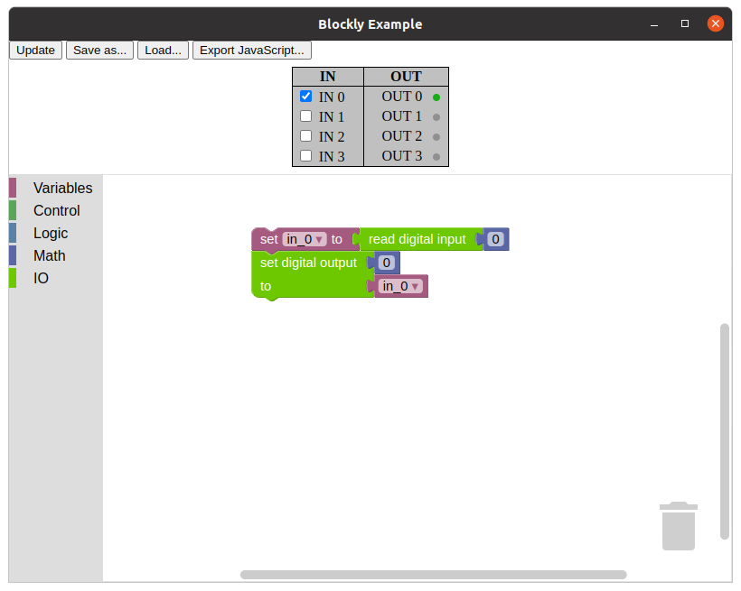

# blockly-example

Example how to use [blockly](https://github.com/google/blockly).



## Build and Run

````
npm install
npm start
````

### Package

````
npm run make
````

### Create Win32 Package with Linux Host

````
npx electron-forge make --platform win32
````

### Build using Docker

````
docker buildx build --rm -f docker/Dockerfile --tag blockly-builder .
docker run -it blockly-builder
````

## Dependencies

- npm
- node
- electron
- blockly
- electron-forge
- wine64 _(cross compile only)_
- mono _(cross compile only)_

